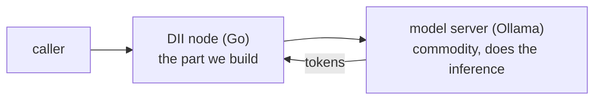
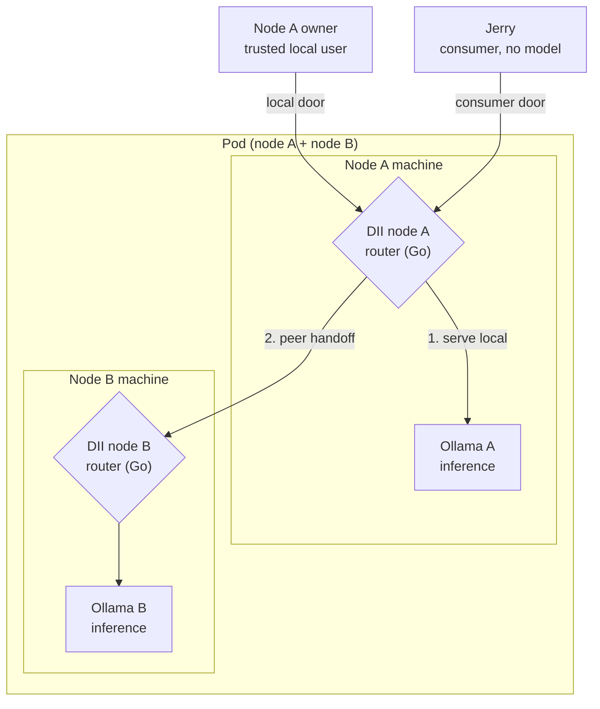
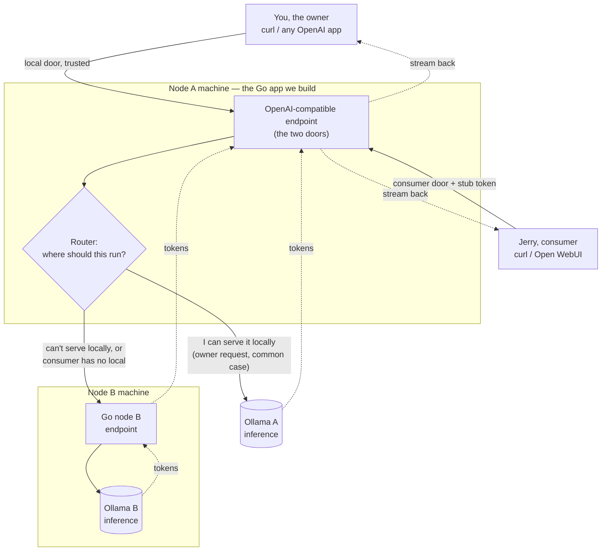
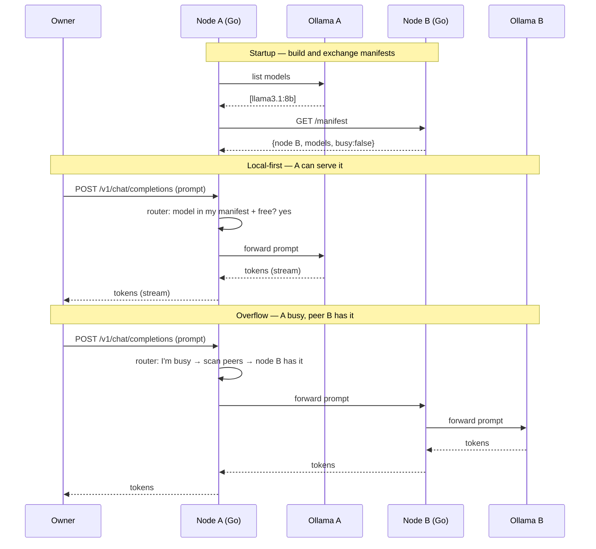

# Prototype Architecture Sketchbook

Status: Realized, updated 2026-07-12 (started 2026-07-08). Informal working notes from the slow walkthrough. The model sketched here was built as the Week-3 prototype (prototype/, prototype/BUILD_BRIEF.md) and validated in M4 (journal/2026-07-12-week3-m4-findings.md), so this file is kept as the design record that fed the build rather than a scratch space. KISS was the rule for the POC.

Update 2026-07-12: the design in these notes has been built as the Week-3 prototype (M1–M4) and validated on a live three-node pod; see prototype/ and journal/2026-07-12-week3-m4-findings.md.

## The pieces so far

Model server. This is the inference engine, Ollama today. Its only job is take a prompt, return tokens. It already speaks the OpenAI-compatible HTTP API. Commodity and swappable. In the ffmpeg analogy, this is ffmpeg. We do not build this.

DII node. A Go app that sits in front of the model server. It receives requests and brokers them to the model server; it never infers itself. Deliberately a broker in front of Ollama rather than wrapping llama.cpp into the Go binary. This is the part we build.

So one machine runs two processes: the model server (Ollama) and the DII node (Go) in front of it.



## What the node actually does

The node is not a plain pass-through proxy. It is a proxy that first decides where a request should run, then brokers it there. That decision-maker is the router, and the router is the actual DII contribution.

With a single node and a single Ollama, the decision is trivial: "I can serve this myself, send it to my Ollama." The decision only gets interesting when the request could run somewhere other than here.

## Two nodes make a pod

Add a second machine: node B, also running its own Ollama. Node A and node B together are a pod. Now "somewhere other than here" exists, and the router has a real choice: serve locally on my own Ollama, or hand off to a peer node.

## Two doors into a node (ADR-0004)

A request can enter a node two ways, and the router treats them differently:

- Trusted local door. The node's own user. Router tries local first (my own Ollama), and only hands off to a peer if it can't serve.
- Consumer / remote door. A stranger with no node of their own (Jerry). Jerry has nothing to "serve locally," so his request skips the local step and goes straight to "find a node in the pod that can serve this."

One router, two doors. Same decision logic, entered at different points.

## Jerry, the pure consumer

Jerry has no node and no Ollama. So:

1. Jerry still has to knock on a door. He points his app at some pod node's address (say node A). Node A is his entry point.
2. Node A sees the request came in on the consumer door, so it knows this is "serve on behalf of a stranger."
3. The router finds a pod node that can serve it. Could be node A's own Ollama, could be node B.

For the POC, selection stays dumb: does some node in the pod have the right capability and some spare capacity? Pick one. No clever load balancing yet.

## The picture so far



## Zoom in: one request's path

Every client (you, Jerry, Open WebUI, curl) points at the Go node, never at Ollama directly. The node always gets the request served by some node's Ollama in the pod. That node is often itself (local-first), and only a peer on overflow. Solid arrows are the request going out, dashed are tokens streaming back.



Read it as: request enters a door, router picks where it runs, it goes to an Ollama (this node's or a peer's), tokens stream back out the same door to the caller.

## The manifest, and the whole workflow

The manifest is how the router answers "who can serve this?" Each node publishes a small self-description, built by asking its model server for its model list (the OpenAI-standard /v1/models call, not an Ollama-specific one, so the backend stays swappable):

```
node_id: A
endpoint: http://node-a:8080
models: [llama3.1:8b]
busy: false
```

Nodes learn each other's manifests from a static peer list in config: on startup, node A fetches node B's manifest from a /manifest route and caches it, and B does the same. After startup, each node holds a table of its own models plus each peer's.

KISS shortcut: an OpenAI request already names a model, so "can I serve this?" reduces to "is that model in my manifest?" Capability equals model-name match for the POC. Richer capability tags (chat, code, vision, quality tiers) are a later layer.



Jerry's path is the overflow shape entered at the consumer door: same manifest lookup, node A serves him from whatever pod node has the model (its own Ollama or B). If no node can serve, the router returns an honest "no capacity" rather than hanging.

## Backend portability: any inference server

Ollama is the POC's backend because it's the easiest to run, not because it's special. Decision: build and test against Ollama, but the node must long-term read from any LLM inference system.

The node talks to its backend through a thin model-server interface, essentially two methods, list models and stream a completion, using the OpenAI-standard API (/v1/models, /v1/chat/completions) rather than any server's native calls. Anything that speaks that API drops in by config: llama.cpp server, vLLM, LM Studio, LocalAI, and others. The interface is the seam: an OpenAI-compatible backend needs only a URL, and a backend that speaks something else gets a small adapter behind the same interface, so the node core never learns about any specific server.

Rule for the POC: use only the common OpenAI subset (chat completions, streaming, model list). Leaning on one server's proprietary extras is exactly what would weld us to a single backend.

## Go package layout (for the build)

One binary is a node. Two nodes is the same binary run twice with different config. The packages map one-to-one onto the six node jobs, which keeps each piece small and reviewable.

```
prototype/
  go.mod
  cmd/node/main.go        - load config, wire packages, start the node
  internal/
    config/               - parse config (listen addr, node_id, model_server URL, consumer_token, peers)
    ingress/              - OpenAI-compatible HTTP server; the two doors; token check selects the door
    router/               - decide where a request runs: local-first, else a peer, else honest fail
    modelserver/          - Backend interface (ListModels, ChatCompletionStream) + OpenAI-compatible client (Ollama is just a base URL)
    manifest/             - build own manifest from modelserver; serve /manifest; fetch + cache peers'
    peer/                 - call another node's OpenAI endpoint (inter-node transport = reuse the OpenAI HTTP call)
  config.example.yaml
```

The seam that keeps us backend-portable is modelserver.Backend: the rest of the node depends on the interface, never on Ollama directly. The build brief in prototype/BUILD_BRIEF.md turns this into a starting task for Claude Code.

## Parking lot (not now, but don't lose them)

- How the consumer door is authenticated. Built as a shared consumer token (string-equality check). The build's identity note records what that stub lacked, node admission, per-consumer credentials, caller attribution across hops (docs/Identity_Note_From_Prototype.md); the real mechanism is the next ADR. See docs/Governance_And_Abuse_Resistance.md.
- Capability manifest: basic shape sketched above (model-name match, /manifest endpoint, static peer list). Still open: a real load/busy signal, and capability tags beyond raw model name.
- Inter-node transport: how node A actually asks node B to serve. Settled: the reused OpenAI-compatible HTTP call, validated in M4 as effectively free (ADR-0011). A thin internal RPC stays the candidate if a later phase needs to carry identity or policy the OpenAI shape has no field for.
- Load balancing / "next available" selection: kept dumb on purpose for the POC.
- Graceful degradation: built. When no node has the model, the router returns an honest, immediate HTTP 503 before any upstream call, rather than hanging.
- All governance, abuse, and fair-use questions live in the separate track (docs/Governance_And_Abuse_Resistance.md), not here.
