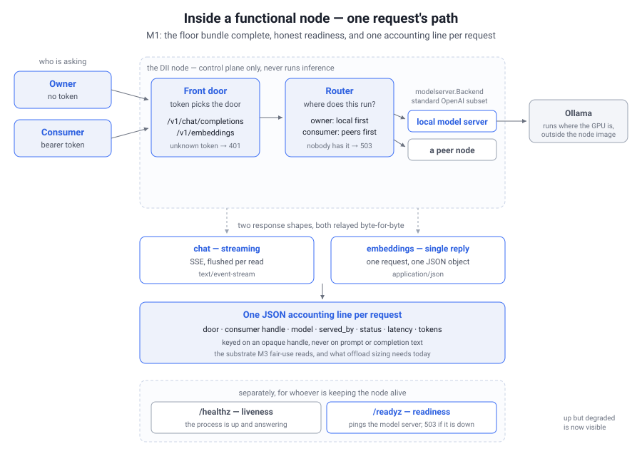

# The DII node

A DII node is a Go control-plane broker in front of an OpenAI-compatible model
server (Ollama); it never runs inference itself, it routes each request to whichever
node in the pod can serve the model. See `../architecture/Sketchbook.md` and
`../architecture/APIs/README.md` for the design, `deploy/` to run it as a service,
and `DEPLOY.md` to run a pod across multiple machines.

## Status: functional node, M1 complete (2026-07-30)

This directory started as the Week-3 proof of concept and is now being promoted to
the functional node (`../docs/Functional_Node_Plan.md`), so it is no longer
throwaway.

**Week 3 — the proof of concept (complete).** Two nodes, SSE streaming end to end,
the two doors, A→B forwarding over the reused OpenAI HTTP call; real inference
through the `modelserver.Backend` seam; manifest build, publish, fetch, and cache;
capability-aware overflow with an honest 503; and a measurement run on a live
3-node pod. All four kill-criteria passed — overflow throughput ~100% of the peer's
own local, TTFT overhead +20–43 ms against a ~200 ms budget, consumer within the
overflow envelope. See `../journal/2026-07-12-week3-m4-findings.md`.

**M1 — floor bundle and reliability (complete).** What makes it a node you can
actually depend on rather than a demo:

- `POST /v1/embeddings`, completing the reliable-floor bundle of general chat, a
  coder, and embeddings (ADR-0006). It is the non-streaming path, handled as such.
- Graceful shutdown on SIGINT/SIGTERM: in-flight streams drain to completion, and
  only a request outliving the deadline is cancelled.
- `/readyz` alongside `/healthz`, so a node that is up but whose backend is down is
  visible instead of looking healthy.
- One JSON accounting line per request, including which node actually served it.
- Container image and compose files in `deploy/` (plus an untested systemd unit),
  and a `DII_CONFIG` env var so nothing depends on the working directory.
- `/v1/models` advertises the whole pod, not just this node's shelf — added during
  M1 testing, when a real GUI client turned out to be unable to discover overflow
  at all. See "What the model list advertises" below.

M2 (per-consumer identity), M3 (fair-use), and M4 (the moderation seam) are next,
and are deliberately absent — see the plan.



## Layout

```
cmd/node/main.go        load config, build+exchange manifests, wire packages, serve, drain
cmd/harness/main.go     measurement harness: TTFT, throughput, total, over N runs
internal/config         parse the YAML config
internal/ingress        OpenAI endpoint; token -> door; relay; health/readiness; accounting
internal/router         local-first or peer-first by door; capability match; honest failure
internal/modelserver    Backend interface + Ollama client (+ mock, from M1)
internal/manifest       node self-description; build own, fetch/cache peers'
internal/peer           call a peer node's OpenAI endpoint + /manifest (implements Backend)
internal/usage          per-request accounting record, JSON-line writer, token metering
deploy/                 Dockerfile, compose (+ macOS and GUI overlays), systemd unit
```

## Run it (one machine, two nodes)

Requires Go 1.22+ and a running Ollama with at least one chat model and one
embedding model pulled:

```sh
ollama pull llama3.2:1b
ollama pull all-minilm:l6-v2
cd prototype
go mod tidy      # resolves gopkg.in/yaml.v3
```

Start both nodes in separate terminals (both point at the local Ollama):

```sh
go run ./cmd/node -config config-a.yaml   # node A on :8080, peer -> :8081
go run ./cmd/node -config config-b.yaml   # node B on :8081, no peers
```

For real overflow between *different* model sets, see `DEPLOY.md`. But note one
useful trick for a single machine: because the consumer door prefers peers, a
consumer-door request to node A is served by node B even when both hold the same
models. That exercises the whole peer path locally.

To run a node as a managed service instead, see `deploy/README.md`.

## Drive it

```sh
# Local door (no token): served by node A's own Ollama
curl -N http://localhost:8080/v1/chat/completions \
  -H 'Content-Type: application/json' \
  -d '{"model":"llama3.2:1b","stream":true,"messages":[{"role":"user","content":"hi"}]}'

# Consumer door (stub token): routed into the pod, peers first
curl -N http://localhost:8080/v1/chat/completions \
  -H 'Content-Type: application/json' \
  -H 'Authorization: Bearer dev-secret' \
  -d '{"model":"llama3.2:1b","stream":true,"messages":[{"role":"user","content":"hi"}]}'

# Embeddings: the non-streaming third of the floor bundle
curl -s http://localhost:8080/v1/embeddings \
  -H 'Content-Type: application/json' \
  -d '{"model":"all-minilm:l6-v2","input":"the reliable floor"}'

# A model no node has -> honest, immediate 503
curl -s -w '\n%{http_code}\n' http://localhost:8080/v1/chat/completions \
  -H 'Content-Type: application/json' \
  -d '{"model":"nope:1b","messages":[{"role":"user","content":"hi"}]}'

# Inspect a node
curl -s http://localhost:8080/manifest    # what this node can serve
curl -s http://localhost:8080/v1/models   # everything the pod can serve, + where each runs
curl    http://localhost:8080/healthz     # liveness  -> node A ok
curl -s http://localhost:8080/readyz      # readiness -> {"ready":true} or 503
```

## Liveness versus readiness

Both exist because they answer different questions, and the difference is the point:

```sh
# with the model server stopped:
curl -s -w ' [%{http_code}]\n' localhost:8080/healthz   # node A ok            [200]
curl -s -w ' [%{http_code}]\n' localhost:8080/readyz    # {"ready":false,...}  [503]
```

`/healthz` is liveness — the process is up, so don't restart it. `/readyz` pings
the model server through the same `Backend` interface the node serves with, so a
node whose Ollama died reports not-ready with the reason. Without that split, a
live-but-degraded node looks fine to every supervisor and directory that asks.

The node also starts successfully when its model server is down, with an empty
model list, so the pod and its manifest exchange stay up. It reports not-ready
until the backend answers.

## What the model list advertises

`/v1/models` lists everything this node can get served — its own models plus its
cached peers' — with `owned_by` saying where each would run:

```sh
$ curl -s localhost:8080/v1/models | jq -r '.data[] | "\(.id)\t-> \(.owned_by)"'
all-minilm:l6-v2      -> local
llama3.2:1b           -> local
qwen2.5:7b            -> http://100.118.77.40:8090
deepseek-r1:32b       -> http://100.118.77.40:8090
```

The reason it is the pod and not just this node: a caller cannot discover overflow
any other way. An OpenAI client builds its model picker from this list, so a model
the node would happily borrow is invisible unless the node admits to it — which
makes "any OpenAI-compatible client is already a DII client" (ADR-0004) true for
chat and false for discovery.

`/manifest` is the counterpart and answers a different question — what this node
*itself* holds — and deliberately still lists only local models. If nodes
republished borrowed models, peers would advertise each other's capacity back and
forth and the capability table would stop meaning anything.

Caveat: manifests are fetched once at startup, so this list can name a model whose
holder has since gone down. That request then fails as a `502` from the dead peer
rather than an immediate `503`.

## Usage accounting

Every request writes one JSON line to stdout:

```json
{"time":"2026-07-30T05:40:54.883Z","node_id":"t1","door":"consumer","consumer":"shared",
 "endpoint":"/v1/embeddings","model":"all-minilm:l6-v2","served_by":"http://localhost:8081",
 "status":200,"latency_ms":43,"prompt_tokens":9,"completion_tokens":0,"tokens_estimated":false}
```

`served_by` is either `local` or the peer endpoint that ran the work, which is what
makes offload sizing answerable: what got routed, where, which model, how big. A
peer-served request appears twice across the pod — on the entry node as
`served_by: <peer>`, and on the peer as `served_by: local`.

The line never contains prompt or completion text, and keys on an opaque
`consumer` handle. That separation is deliberate: it is the data-minimization seam
ADR-0016 describes, where the pod holds token to handle to counters and never joins
the content stream to the identity stream. M1 has no per-consumer credentials yet,
so every request through the one shared token logs as `shared`; M2 replaces that
with a real handle per issued token.

### What the token counts mean

`tokens_estimated` is the field to read first, because two of three paths are exact
and one is not:

| Request | Source | Exact? |
|---|---|---|
| `"stream": false` | the response's own `usage` block | yes |
| streaming with `stream_options: {"include_usage": true}` | the final SSE chunk's `usage` | yes |
| **streaming, no `stream_options`** (the common case) | count of content chunks; prompt tokens unknown, reported `0` | **no** |

The node does not inject `stream_options` into your request to force exact numbers,
because it promises to forward request bodies verbatim and that would also append a
usage chunk some strict clients do not expect. If you want exact accounting today,
ask for it in the client. In practice the chunk proxy tracks Ollama closely — same
prompt, 14 chunks estimated against 14 tokens exact — but it is a proxy, prompt
tokens are genuinely missing, and closing that gap is open work for when M3's token
budgets need precision.

## Graceful shutdown

On SIGINT or SIGTERM the node stops accepting new connections and lets in-flight
requests finish, up to `shutdown_timeout` (default 15s). A stream still running at
the deadline has its context cancelled rather than being left to hang. Under Docker
or systemd, make sure the supervisor's own stop grace period is larger than
`shutdown_timeout` — see `deploy/README.md`.

## Helper scripts

```sh
scripts/ask.sh <model> [prompt]                 # ask the hub; router picks the node
scripts/pod-status.sh <node-url> [<node-url>…]  # each node's manifest + reachability
scripts/m1-check.sh [<node-url>]                # check everything M1 added; exits 0 if clean
```
`DII_HUB` overrides the target node (default `http://localhost:8080`); `DII_TOKEN`
sends the consumer-door bearer token. `m1-check.sh` also takes `DII_CHAT_MODEL` and
`DII_EMBED_MODEL` so it can run against a pod with a different roster:

```sh
DII_CHAT_MODEL=qwen2.5:7b DII_EMBED_MODEL=all-minilm:l6-v2 \
  scripts/m1-check.sh http://100.118.77.40:8090
```
